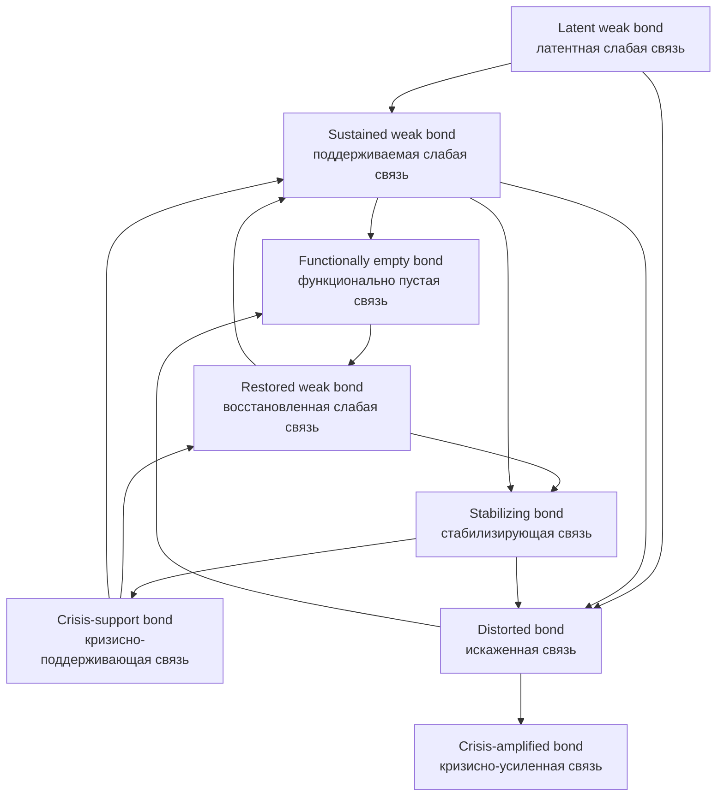

# Bond Lifecycle Map

This note gives a compact visual map of the bond lifecycle described in the surrounding Volume VI working notes.

## Visual map

## Reading the map

- `Latent weak bond (латентная слабая связь)`:
  a low-energy but still living relational possibility.

- `Sustained weak bond (поддерживаемая слабая связь)`:
  a weak bond that stays alive through rhythm, attunement, and repeated low-cost renewal.

- `Functionally empty bond (функционально пустая связь)`:
  a bond that still exists structurally but no longer works as a path of return.

- `Restored weak bond (восстановленная слабая связь)`:
  a weak bond that regains enough meaning, safety, and usability to become living again.

- `Stabilizing bond (стабилизирующая связь)`:
  a bond that becomes helpful under stress and supports regathering.

- `Crisis-support bond (кризисно-поддерживающая связь)`:
  a temporarily strengthened stabilizing bond that helps hold the field together during crisis.

- `Distorted bond (искаженная связь)`:
  a bond that starts carrying mismatch or destructive transmission.

- `Crisis-amplified bond (кризисно-усиленная связь)`:
  a distorted bond that helps intensify bad collective motion.

## Healthy direction

The main healthy movement is:

- latent weak,
- sustained weak,
- restored weak,
- stabilizing,
- crisis-support,
- and then back into restored or sustained weak relation.

## Degrading direction

The main degrading movement is:

- weak or stabilizing relation becoming distorted,
- then distorted relation becoming crisis-amplified.

## Why this matters

This map makes visible a key Volume VI idea:

- the bond is not a fixed edge,
- but a living relational unit with a trajectory.

That trajectory becomes one of the main bridges between:

- living field memory,
- collective re-bonding,
- and route-sensitive re-entry into the field.
