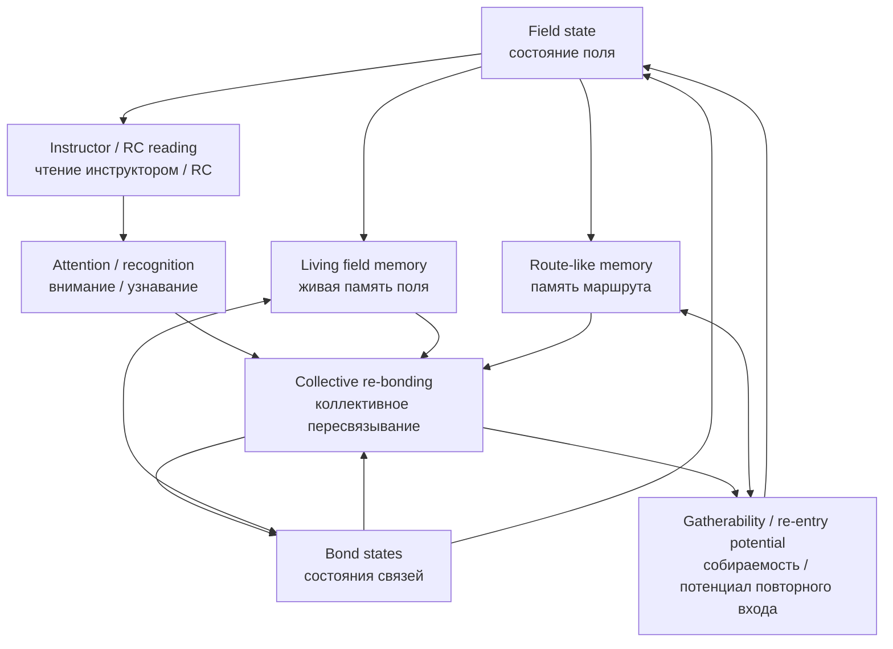

# Field / Instructor / Bonds / Memory Loop

This note gives the second core visual for the opening of Volume VI.

If the bond lifecycle map shows how a bond changes, this map shows how the larger architecture circulates through:

- field,
- instructor,
- bonds,
- and memory.

## Visual loop

## Reading the loop

- `Field state (состояние поля)`:
  the present whole pattern of coherence, drift, contagion, and gatherability.

- `Instructor / RC reading (чтение инструктором / RC)`:
  interpretation of the field, not replacement of it.

- `Attention / recognition (внимание / узнавание)`:
  the mechanism by which the instructor highlights danger, route, and possible return.

- `Bond states (состояния связей)`:
  the living condition of weak, empty, stabilizing, or distorted ties.

- `Collective re-bonding (коллективное пересвязывание)`:
  the process by which the network reorganizes weak links under stress.

- `Living field memory (живая память поля)`:
  memory of field configurations and remembered gatherability.

- `Route-like memory (память маршрута)`:
  memory of how the field entered crisis and what paths back may exist.

- `Gatherability / re-entry potential (собираемость / потенциал повторного входа)`:
  whether the field can become coherently alive again.

## Minimal interpretation

The next architecture is a loop, not a line.

It does not work as:

- instructor commands,
- agents obey,
- crisis ends.

It works as:

- the field reveals,
- the instructor reads,
- memory informs,
- bonds reorganize,
- the field changes,
- and gatherability either returns or fails to return.

## Why this matters

This loop gives the opening structural picture of Volume VI:

- not only smarter instruction,
- but field-led diagnosis,
- memory-bearing relation,
- and route-sensitive collective return.
