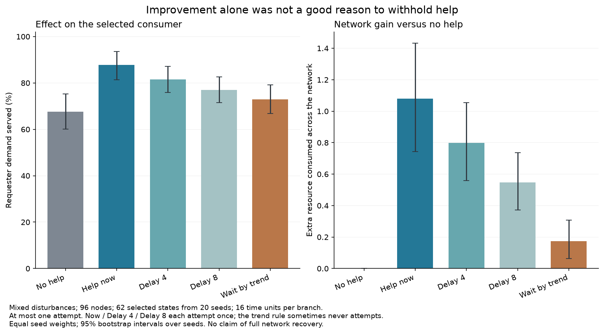

# Время одной попытки помощи: результат 8 октября 2026

**В выбранных состояниях с сохраняющейся нехваткой и уже начавшимся улучшением помощь сразу в среднем полезнее ожидания по двум признакам.** Первичный результат для n96/mixed: +0.905 единицы реально потреблённого ресурса всей сетью за следующие 16 единиц времени, 95% парный интервал [0.617; 1.192], относительно правила ожидания. Подбор состояния не использовал будущее.

Есть и результат при одинаковом числе попыток: одна попытка сразу даёт больше суммарной пользы за общий горизонт, чем одна попытка через 4 или 8 единиц времени. Это основание пересмотреть запрет «при улучшении пока не помогать». Это не доказательство оптимального контроллера, полного восстановления сети или необходимости помогать при любой тревоге.

[Протокол до расчёта](help_timing_protocol_2026-10-08.md) · [Архив исходных данных](../../research_results/help_timing_2026-10-08) · [Парные сравнения](../../research_results/help_timing_2026-10-08/paired_comparisons.csv) · [Карта остальных направлений](research_vectors_2026-10-08.md)

## Дизайн

Использованы неизменные динамика ресурсного стенда и правило выбора локальной перестройки. Новые seed 23000..23019, размеры 96/384, среды смешанных нарушений, временного повреждения и недостаточной подачи: 120 исходных автономных миров. Ещё 8 конфигураций на четырёх новых seed проверяют шаг 0.2/0.1.

В шести заранее выбранных моментах случайно выбирается не более одного потребителя из каждой наблюдаемой категории: «устойчивая нехватка, но улучшается» и «устойчивая нехватка без достаточного улучшения». Если категория пуста, пример не создаётся. Всего 1 118 выбранных контрольных состояний и 5 590 продолжений; 418 слотов остались пустыми. Это не 5 590 независимых миров.

Каждое состояние полностью копируется в пять веток: без помощи, одна попытка сразу, через 4, через 8 и по правилу двух признаков в пределах первых 8 единиц. Продолжение — 16 единиц времени от общей начальной точки. Других вмешательств нет. Неудачная попытка не повторяется. Случайные предпочтения механизма выбора одинаковы между временами, но доступность помощника и накопленные оценки качества закономерно меняются.

При вызове правила «сразу» момент контрольной точки уже находится после возникновения устойчивой нехватки. Это не прогноз кризиса до первых симптомов. Все исходные состояния получены в автономной сети без предшествующих перестроек, поэтому их распределение отличается от состояний работающего постоянного регулятора.

## Первичная группа: 96 узлов, смешанные нарушения, улучшение при нехватке

62 выбранных состояния на 20 seed. Числа качества и прибавок сначала усредняются внутри seed, затем по seed с равными весами. Число попыток и успешных перестроек в таблице — обычные суммы по всем 62 состояниям.

| Время попытки | Спрос выбранного потребителя выполнен, % | Выполнение спроса всей сети, % | Дополнительно потреблено сетью против отсутствия помощи | Попытки / успешные перестройки |
|---|---:|---:|---:|---:|
| Без помощи | 67.60 | 83.92 | 0 | 0 / 0 |
| Сразу | 87.74 | 84.53 | +1.079 | 62 / 42 |
| Через 4 | 81.59 | 84.37 | +0.799 | 62 / 43 |
| Через 8 | 76.92 | 84.23 | +0.547 | 62 / 46 |
| По прежнему правилу ожидания | 72.85 | 84.01 | +0.174 | 12 / 9 |

Таким образом, непосредственная помощь улучшает среднее снабжение выбранного потребителя примерно на 20.14 п.п. против отсутствия помощи и на 14.88 п.п. против правила ожидания. Для всей сети эти изменения гораздо меньше: примерно +0.62 и +0.52 п.п. соответственно. Эти вторичные значения описательные; первичный интервал рассчитан для общего потреблённого ресурса.

Правило ожидания в 50 из 62 состояний вообще не запросило помощь в отведённые 8 единиц. Поэтому контраст «сразу — правило» включает и время, и решение не вмешиваться. Более чистая проверка времени — сравнение трёх фиксированных моментов, где всегда ровно одна попытка:

- через 4 минус сразу: −0.280 ресурса [−0.425; −0.154];
- через 8 минус сразу: −0.532 [−0.724; −0.358].

Средняя фактическая плата успешных операций 0.0795 / 0.0815 / 0.0885 для сразу/через4/через8. Для прежнего правила 0.0150, а трафик в среднем 5.1 сообщения вместо 29.3 при немедленной помощи. Значит, более частое использование разрешённой попытки повышает и фактические затраты; одинаковое разрешение не равно одинаковому расходу. Плата уже вычтена из ресурса помощника в динамике и не вычитается повторно из потребления.



Раннее вмешательство действует дольше в общем окне наблюдения. Опыт показывает преимущество по накопленной работе за это окно, но не отделяет его от продолжительности действия и не доказывает существование специального краткого «окна совместимости». При другом горизонте результат требует проверки.

## Где ограничивает правило, а где — доступное действие

Порог «полезно для сети» задан заранее: >0.01 дополнительной единицы потреблённого ресурса против none. «Заметно лучше инициатору» — не менее +5 п.п. выполнения его спроса. Это масштабы игрушечной модели.

| Смешанный сценарий | Выбранных состояний | Перестройка нашлась хотя бы в одной ветке | Нашлась ветка с пользой сети | Нашлась ветка с пользой сети и >=5 п.п. инициатору |
|---|---:|---:|---:|---:|
| 96, нехватка с улучшением | 62 | 46 | 44 | 29 |
| 96, нехватка без улучшения | 118 | 39 | 38 | 35 |
| 384, нехватка с улучшением | 76 | 62 | 59 | 45 |
| 384, нехватка без улучшения | 120 | 43 | 41 | 35 |

В первой группе немедленная попытка полезна для сети в 41/62 состояниях, вредна по порогу <−0.01 в 1/62. Правило ожидания полезно в 9/62. Среди 44 состояний с хотя бы одним полезным вариантом оно упустило 35. Это ретроспективная оценка доступных возможностей, а не готовый способ распознать их заранее.

У застрявших узлов текущий механизм часто не находит допустимую перестройку ни в один из проверенных моментов. Это ограничение **данного правила поиска, соседства и запаса ресурса**, а не доказательство отсутствия любого возможного помощника. Перестройка не является универсальным лечением недостаточной подачи ресурса.

Выбор лучшего из пяти продолжений, включая отсутствие помощи, даёт в первой группе +1.121 ресурса, немедленная помощь — +1.079. Этот выбор знает будущее, его прибавка неотрицательна по определению и не считается самостоятельным наученным контроллером. В данном наборе проверенных вариантов большая часть доступного выигрыша достигается простым немедленным действием; сложное угадывание момента пока не обосновано.

Когда исходное правило уже разрешало помощь (категория stalled), now и trend_rule дают точно одинаковые траектории. Это проверено для всех таких строк. Сравнение категорий между собой не доказывает, что улучшение причинно создаёт доступного помощника: категории могут различаться геометрией и состоянием ресурсов.

## Размер, шаг и границы

При n384/mixed/improving первичный по смыслу контраст now−trend_rule также положителен: +0.781 ресурса [0.619; 0.936] на 76 состояниях из 20 seed; это вторичное сравнение.

На четырёх новых seed n96/mixed/improving разница при шаге 0.2 — +0.969 [0.320; 1.618], при 0.1 — +0.889 [0.307; 1.520]. Направление сохранилось, но четыре seed — слабая проверка устойчивости. Из-за дискретного пересечения порогов могут отбираться другие потребители и меняться допустимые перестройки. Это не доказательство численной сходимости всех индивидуальных решений.

Для временного повреждения первичная по смыслу прибавка немедленной помощи относительно ожидания в улучшающейся группе положительна по среднему: около +0.737 ресурса при n96 и +0.508 при n384. В scarcity такая категория редка: только 8/20 seed при n96 и 18/20 при n384, по одному состоянию; вывод нельзя распространять на всех испытывающих дефицит узлов.

Во всех пяти ветках первичных 62 состояний полного обслуживания всех потребителей на каждом шаге последних четырёх единиц не было. Одна удачная помощь может существенно поддержать выбранного потребителя, но не решает автоматически проблемы других. Поэтому большой местный прирост нельзя называть восстановлением всей системы.

Ограничения предыдущего стенда сохраняются: идеальные местные измерения, атомарная операция согласования, заданная ресурсная геометрия, отсутствие ошибок сообщений, внутренней диагностики LLM и нескольких полезных режимов. Здесь не проверяли многократное вмешательство, изменение вида помощи, цену измерений, подбор других соседей вне текущего поиска или полную модель PRC.

## Решение

Гипотеза о пользе своевременной помощи в этой узкой постановке получила поддержку. Не следует автоматически запрещать помощь лишь потому, что состояние улучшается. Сначала стоит использовать простой регулятор устойчивой нехватки как базу; следующий возможный вопрос — ограниченное ожидание с учётом глубины и длительности дефицита при сопоставимом фактическом бюджете. Новая сложная диагностика не требуется только ради найденного эффекта.

Одновременно случаи, где текущая операция недоступна, сохраняют отдельный вопрос смены способа помощи. Ветки выхода из изоляции, фактической цены памяти и других полезных режимов из карты I–VI остаются открытыми.

## Проверка и воспроизведение

58 автоматических проверок прошли. Проверены независимость копий веток, точное время попыток, максимум одна попытка, баланс ресурса, трафик, сбор всех непустых состояний, отсутствие подмены пустых групп и хеши кода/протокола. 80 продолжений из сохранённых NPZ точно воспроизведены; максимальная ошибка баланса 2.28×10⁻¹³. Все отобранные состояния и все итоговые ветки сохранены. Граф восстанавливается по seed, поскольку до ветвления не перестраивался. Полные временные ряды каждой ветки не сохранялись, но воспроизводятся из состояния и снимков кода.

```sh
python -m unittest discover -s simulations -p 'test_*.py'
python simulations/experiment_help_timing.py --workers 4
python simulations/report_help_timing.py
python simulations/plot_help_timing.py
```

Для нового каталога указать `--out outputs/<имя>` всем трём скриптам. Основной расчёт не перезаписывает непустую папку. Для отчёта из архива скопировать каталог в outputs; исполняемые модули должны соответствовать сохранённым снимкам (допускается различие LF/CRLF). Интервалы — парный bootstrap по seed после усреднения его контрольных точек, 5 000 повторений. Прочие сравнения разведочные без поправки на множественность.
