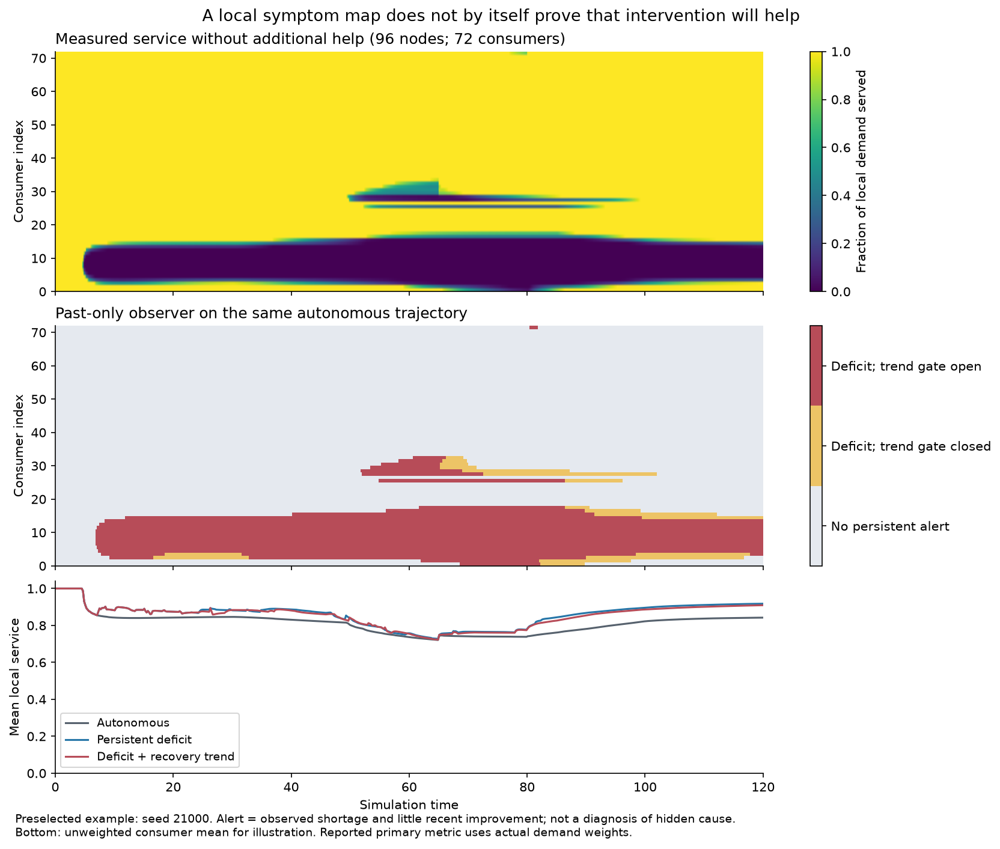

# Два признака местного восстановления: результат 8 октября 2026

**Наблюдение даёт полезную информацию, но выбранное правило помощи не улучшило снабжение относительно простого ожидания устойчивой нехватки.** В первичном смешанном сценарии два признака сократили сообщения на 16.2% и плату перестройки на 8.1%, при снижении снабжения на 0.122 процентного пункта. Это компромисс между вмешательствами и качеством, не установленное преимущество PRC.

[Протокол до расчёта](minimal_observer_protocol_2026-10-08.md) · [Карта нескольких направлений I–VI](research_vectors_2026-10-08.md) · [Архив](../../research_results/minimal_observer_2026-10-08) · [Все парные сравнения](../../research_results/minimal_observer_2026-10-08/paired_comparisons.csv)

## Что именно реализовано

Вместо определения единственного типа кризиса каждый потребитель наблюдает собственную выполненную долю спроса. Первый признак — её сглаженный уровень. Второй — изменение за последние 4 единицы времени. Если нехватка сохраняется 2 единицы времени, но улучшение превышает 0.02, двухпризнаковый механизм пока воздерживается от запроса. Названия кризисов и будущее не доступны контроллеру.

Помощь — локальная перестройка связей из ранее проверенного ресурсного стенда; не чаще одного запроса на узел за 8 единиц времени, с платой ресурса за успешную перестройку. Нет принудительного сброса состояния или дополнительной подачи ресурса. Это ограниченная дискретная помощь, а не плавное фазовое воздействие из уравнений VI.

Сравниваются автономная работа сети; простой сглаженный порог; порог с ожиданием устойчивой нехватки; два признака; перемешивание получателей точного расписания двухпризнакового механизма. Контроллеры имеют одинаковые пределы допустимых действий, но разный фактический расход. Внутренняя динамика и механизм перестройки взяты без изменения из `experiment_local_support_signal.py`.

## Основное сравнение: смешанные нарушения, 96 узлов

20 парных миров. В разных областях перекрываются постепенное повреждение связей, рост спроса и падение подачи. Основное снабжение — отношение фактически потреблённого ресурса к спросу за t=20..120, а не доля полностью восстановившихся узлов.

| Политика | Выполненный спрос, % | Запросы | Сообщения | Плата ресурсом | Полное обслуживание в последнем окне |
|---|---:|---:|---:|---:|---:|
| Автономная сеть | 84.47 | 0 | 0 | 0 | 1/20 |
| Простой уровень нехватки | 89.58 | 196.75 | 4 965.2 | 3.648 | 5/20 |
| Устойчивая нехватка | 89.57 | 189.65 | 4 774.0 | 3.336 | 6/20 |
| Нехватка + ход восстановления | 89.45 | 158.25 | 4 002.4 | 3.066 | 6/20 |
| Перемешанные получатели | 89.67 | 158.25 | 4 499.2 | 10.518 | 5/20 |

Первичное `два признака − устойчивая нехватка`: **−0.122 п.п., 95% парный bootstrap [−0.255; −0.0007] п.п.** Верхняя граница очень близка к нулю; малый отрицательный эффект нельзя объявлять устойчивым к численному шагу. Запросов меньше на 16.6%, сообщений — на 16.2%, платы — на 8.1%. Парная разница сообщений −771.6 [−866.8; −678.8].

Относительно автономной сети два признака с помощью дают +4.98 п.п. [4.06; 5.96], но простой регулятор даёт сопоставимое улучшение. Поэтому этот контраст не выделяет ценность второго признака. Автономная сеть здесь означает исходные потоки без новой перестройки, а не все возможные механизмы самовосстановления.

Перемешанный контроль сохраняет число и время запросов, но его успешных перестроек больше: 87.65 против 25.55. Его фактическая плата гораздо выше, а надёжного выигрыша адресной схемы по среднему снабжению не установлено (−0.221 п.п. [−0.856; +0.395] относительно перемешанного). Это нельзя выдавать за доказательство равенства всей стоимости двух политик.

## Что показывают «лампочки»

На автономной траектории каждые 4 единицы времени после t=20 фиксируется тревога. Затем проверяется, останется ли средняя доля обслуживания ниже 95% в следующие 8 единиц. Будущее используется только после опыта для оценки. Это прогноз сохраняющейся нехватки, а не доказательство полезности вмешательства.

| Сигнал, n=96/mixed | Доля подтверждённых тревог | Доля найденных случаев будущей нехватки | Тревоги среди будущих благополучных окон |
|---|---:|---:|---:|
| Простой уровень | 92.85% | 90.86% | 2.15% |
| Устойчивая нехватка | 92.84% | 88.47% | 2.10% |
| Два признака | 98.09% | 76.38% | 0.46% |

Два признака делают тревогу более избирательной, но пропускают больше неблагополучных окон. Нельзя говорить просто «точность 98%»: это доля подтверждений среди тревог, а не общая точность, не вероятность необходимости помощи и не гарантия полного восстановления. Временные окна перекрываются; таблица описательная, они не считаются независимыми повторениями.



На карте показан заранее выбранный первый seed 21000. Верх — измеренное снабжение 72 потребителей в автономной сети; середина — сигналы только по прошлому; низ — сравнение временных рядов трёх политик. На нижнем графике простое среднее по потребителям для иллюстрации, в главной таблице — вес по фактическому спросу. Серый цвет означает отсутствие устойчивой тревоги, а не установленное здоровье. Карта не показывает причину нарушения или «внутренности» LLM.

## Другие условия и устойчивость

Основная серия: 2 размера × 5 сред × 20 seed × 5 политик = 1 000 запусков. Дополнительно 100 с заранее заданным разбросом параметров и 60 для проверки шага. Всего 1 160 запусков на 232 конфигурациях мира; 232 конфигурации не являются 232 независимыми случайными реализациями, поскольку seed повторяются между сценариями, размерами и численными шагами. Парные интервалы внутри каждой группы построены по 20 seed (или 6 в проверке шага), 5 000 повторений. Только одна проверка первичная, остальные разведочные без поправки на множественность.

| Среда | n | Автономно, % спроса | Устойчивая нехватка, % | Два признака, % |
|---|---:|---:|---:|---:|
| Без внешнего изменения | 96 | 91.53 | 93.84 | 93.82 |
| Временное повреждение | 96 | 89.40 | 93.73 | 93.56 |
| Смешанные нарушения | 96 | 84.47 | 89.57 | 89.45 |
| Повторные повреждения | 96 | 83.56 | 89.75 | 89.43 |
| Недостаточная общая подача | 96 | 75.69 | 76.97 | 76.97 |
| Без внешнего изменения | 384 | 89.50 | 91.96 | 91.89 |
| Временное повреждение | 384 | 87.38 | 91.40 | 91.33 |
| Смешанные нарушения | 384 | 82.47 | 86.58 | 86.44 |
| Повторные повреждения | 384 | 81.93 | 87.44 | 87.34 |
| Недостаточная общая подача | 384 | 73.94 | 75.26 | 75.27 |

При n=384/mixed сообщения снижаются на 12.6%, снабжение — на 0.133 п.п. [−0.212; −0.054]. Ни в одной из десяти основных групп средний выигрыш второго признака по снабжению не подтверждён.

При разбросе коэффициентов в n=96/mixed снабжение persistent/two_signals = 89.11%/88.98%; разница −0.124 п.п. [−0.285; +0.017]. Здесь варьировались поузловые подача и спрос и общие проводимость, утечка и предел передачи ±20%, а не все коэффициенты возможного PRC.

На шести новых seed уменьшение шага 0.2→0.1 меняет разницу two_signals−persistent с −0.131 п.п. [−0.231; −0.032] до +0.00024 п.п. [−0.156; +0.155]. Экономия сообщений сохраняется примерно 15.2–15.4%. Следовательно, небольшой ущерб по снабжению не вполне численно устойчив; подтверждённого превосходства по снабжению всё равно нет. Мы не подбирали параметры после расчёта.

## Самовосстановление и ограничения

Строгий финальный критерий: каждый потребитель получает не менее 95% своего текущего спроса **на каждом шаге последних 10 единиц времени**. Для n=96/mixed оба сравниваемых регулятора достигли его в 6/20 мирах. Для n=384/mixed — 0/20 у всех политик. Средние около 86–90% нельзя назвать полным восстановлением всей сети.

Даже среда quiet не гарантирует полноценного исходного снабжения: случайное расположение источников и местная геометрия уже создают дефицит. Поэтому часть выигрыша — улучшение базового распределения ресурсов, а не только помощь после внешнего кризиса. В scarcity перестройка немного помогает распределению, но не устраняет недостаточную общую подачу; сигналы о нехватке не означают, что выбранное действие способно её устранить.

Не моделируются вредное зацикливание, искажение сообщений, неизвестные эталонные ответы, измерительный шум, стоимость датчиков и хранения истории, радиоколлизии и согласование реальных роботов. Два признака происходят из одной измеряемой величины — обслуживания узла. Это не доказательство диагностики всех типов кризиса. Контроллер реактивный: он замечает уже возникшую нехватку, а не предсказывает ещё не проявившийся кризис.

Опыт также не доказывает метастабильность, переключение между несколькими полезными режимами, минимально возможное управление или все положения частей I–VI. Разрешённая помощь одна; вся схема цикличной модели не воспроизведена.

## Решение по ветке и проверка

Идею наблюдения сохраняем как отдельную линию; текущий трендовый запрет помощи не заменяет простой регулятор на основании этого опыта. Если продолжать эту ветку, нужен контроль с более редкими запросами простого регулятора при сопоставимом фактическом расходе, а также проверка того, кому доступная помощь действительно полезна. Сначала следует зафиксировать допустимый компромисс между снабжением и ценой вмешательства, а не объявлять экономию победой после просмотра результатов.

Параллельно остаются самостоятельные вопросы [карты I–VI](research_vectors_2026-10-08.md): выход из изоляции при сопоставимой силе релаксации, фактическая польза памяти и сохранение разных полезных режимов.

54 автоматические проверки прошли. Проверены полнота сетки запусков, баланс ресурса (максимальная ошибка 2.28×10⁻¹³), предел передачи, формула трафика, равенство расписаний запросов перемешанного контроля, хеши кода и протокола. 15 строк в трёх заранее указанных конфигурациях точно воспроизведены повторным расчётом. Сохранены все итоговые строки и диагностические счётчики; полные временные ряды сохранены только для заранее выбранных seed 21000 и 21100, не для всех 1 160 запусков.

```sh
python -m unittest discover -s simulations -p 'test_*.py'
python simulations/experiment_minimal_observer.py --workers 4
python simulations/report_minimal_observer.py
python simulations/plot_minimal_observer.py
```

Для нового каталога использовать `--out outputs/<имя>` во всех трёх командах. Основной расчёт не перезаписывает непустую папку. Для воспроизведения архивного отчёта скопировать папку архива в `outputs/`; проверка отчёта требует соответствующих сохранённым снимкам исполняемых модулей, допускается только различие LF/CRLF.
