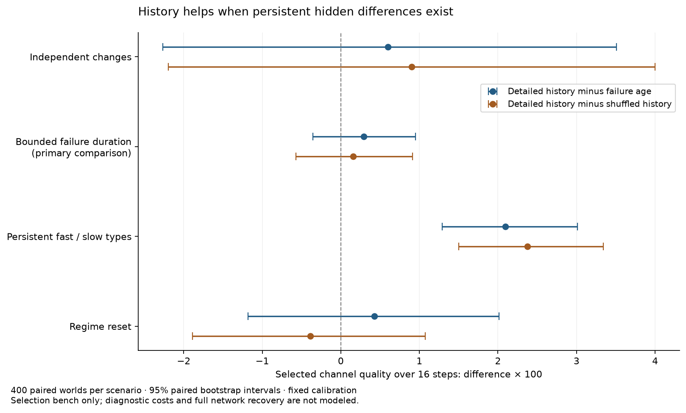

# История связи: результат 5 октября 2026

Подробная история не показала преимущества над возрастом текущего сбоя в первичном сравнении: **+0.29 пункта качества, 95% парный интервал [−0.35; +0.95]**. В специально заданной среде с постоянными скрытыми быстрыми и медленными типами она помогла: **+2.10 пункта [1.29; 3.01]** сверх возраста. Это ограниченное подтверждение пользы распознавания устойчивых различий между каналами, а не доказательство нового принципа восстановления.

[Протокол до расчёта](recovery_history_protocol_2026-10-05.md) · [Исходные данные и снимки](../../research_results/recovery_history_2026-10-05) · [Парные сравнения](../../research_results/recovery_history_2026-10-05/paired_comparisons.csv)

## Что проверяли

В каждом из 400 независимых миров на сценарий есть 8 каналов. Все сейчас не работают: наблюдаемое качество 0.20. Из общей истории в 64 отсчёта на канал метод выбирает один, затем измеряем его среднее качество за следующие 16 отсчётов. Хорошее состояние даёт 0.98. Всего 1 600 независимых миров и 9 600 решений шести методов. Независимая калибровка — 30 000 каналов на каждый из трёх законов среды; это не дополнительные испытания восстановления.

«История» здесь — возраст отказа, длина предшествующего хорошего периода и число недавних переключений. Это небольшой статистический предиктор, не полная модель мостовой связи или Volume VI. Сглаживание EMA также обучено предсказывать будущее на независимых данных, а не используется как неподтверждённая догадка «больше значит лучше». Названия сценариев и скрытые типы не входят в признаки; подходящую обучающую выборку для закона среды задаёт экспериментатор. При смене режима используется прежняя калибровка.

## Среднее качество выбранного канала

Все числа ниже — **качество × 100**, а не проценты восстановленных узлов. Разница выражена в пунктах этой шкалы. «Будущее известно» — недостижимая для обычного метода верхняя граница.

| Среда | Последний контакт | EMA | Возраст сбоя | Подробная история | Перемешанная история | Будущее известно |
|---|---:|---:|---:|---:|---:|---:|
| Независимые смены состояния | 49.79 | 50.93 | 49.96 | 50.55 | 49.65 | 83.75 |
| Периоды 4–20, одинаковый закон | 59.29 | 70.74 | 73.06 | 73.36 | 73.20 | 86.58 |
| Постоянные быстрые/медленные типы | 55.30 | 65.98 | 75.09 | 77.18 | 74.81 | 82.25 |
| После смены режима | 49.01 | 50.71 | 50.42 | 50.85 | 51.24 | 83.62 |

| Среда | История минус возраст | 95% парный интервал | Статус сравнения |
|---|---:|---:|---|
| Независимые смены | +0.60 | [−2.27; +3.51] | Отрицательный контроль |
| Периоды 4–20 | **+0.29** | **[−0.35; +0.95]** | **Первичное, заранее выбранное** |
| Постоянные типы | +2.10 | [+1.29; +3.01] | Разведочный положительный контроль |
| После смены режима | +0.43 | [−1.18; +2.01] | Разведочная проверка переноса |



Интервалы: 5 000 повторений bootstrap по целым независимым мирам, с общей ситуацией для сравниваемых методов. Обучающие выборки фиксированы; неопределённость повторного обучения не включена. Дополнительные сравнения без поправки на множественность. Интервал, включающий ноль, не доказывает точного равенства.

## Что означают контроли

**Одинаковые правила.** При независимых равномерных длительностях 4–20 возраст текущего отказа содержит всю нужную информацию о его остатке. Разница между последним контактом и подробной историей выглядит большой (+14.06 пункта), но почти весь выигрыш уже даёт простой возраст. Это ожидаемое свойство генератора, а не найденный новый закон. По сравнению с EMA история лучше на 2.62 пункта [1.01; 4.28], но сильнейший простой контроль меняет вывод.

**Постоянные различия.** У быстрых каналов каждый период длится 4–8 отсчётов, у медленных — 16–28. Предшествующая история помогает различить типы, когда один только текущий возраст ещё неоднозначен. После перемешивания старого порядка качество снижается: история выигрывает у перемешанного контроля 2.38 пункта [1.50; 3.34]. Перемешивание сохраняет возраст и число хороших состояний, а модель заново калибруется на таком формате. Это свидетельство полезности порядка в данном искусственном генераторе, не доказательство универсальной «памяти пути кризиса». На первых четырёх отсчётах разница с возрастом +8.87 пункта [6.83; 11.16]; это дополнительная метрика, а не замена первичной.

**Разрыв с прошлым.** После смены режима преимущество по выбору не установлено. Средняя квадратичная ошибка прогноза по всем кандидатам у подробной истории 0.07851, у возраста 0.06694, у последнего контакта 0.05535. Это описательное сравнение: старые подробные прогнозы могут стать хуже откалиброваны, хотя подтверждённого ухудшения выбранного канала здесь нет. Стенд не проверяет детектор смены режима, забывание или повторное обучение.

## Чего результат не устанавливает

- Совпадает наблюдаемое настоящее, но не полное скрытое состояние. Постоянный тип намеренно вложен в генератор; это не самостоятельное возникновение новой структуры.
- Все 512 диагностических наблюдений на мир уже доступны, включая неиспользуемые связи. Стоимость их получения и хранения не учтена.
- Нет ресурсных потоков, конкуренции за соседа, стоимости перестройки, движения, потерь сообщений и распределённого согласования. Выбор хорошего канала не равен полному восстановлению сети.
- Один набор параметров, одна калибровка каждого закона и один горизонт не устанавливают устойчивость к другим условиям. Параметры после результата не подбирались.
- Память в сетях и прогноз по истории известны: [Rosvall et al., 2014](https://doi.org/10.1038/ncomms5630), [исследование прогноза по памяти сети](https://link.springer.com/article/10.1007/s41109-023-00597-w). Новизна не заявляется.

## Решение о продолжении

**Подробную память в основную ресурсную сеть пока не переносим.** Главная проверка не дала основания усложнять её сверх возраста сбоя. Положительный контроль оставляет узкое практическое направление: распознавать устойчивые различия, если такие различия действительно есть в целевой задаче.

Следующий обоснованный вопрос при продолжении этой ветки — остаётся ли этот небольшой выигрыш, когда историю нужно получать редкими платными пробами, и может ли простой способ оценивать тип связи дать тот же результат. Сначала нужна конкретная задача с объяснимыми различиями каналов; придумывать новую сложную архитектуру только ради положительного контроля не следует. Эта серия не является самостоятельным научным результатом о новом механизме.

## Проверка и воспроизведение

49 автоматических проверок всей текущей подборки прошли. Новые проверки контролируют возраст отказа и границы периодов, сохранение возраста и числа состояний при перемешивании, независимость интерфейса прогноза от проверочного будущего, воспроизводимость и общий порядок ничьих. Все 9 600 строк решений точно воспроизведены из сохранённых калибровок и траекторий; SHA-256 протокола и исполняемого снимка проверены.

```sh
python -m unittest discover -s simulations -p 'test_*.py'
python simulations/experiment_recovery_history.py
python simulations/report_recovery_history.py
python simulations/plot_recovery_history.py
```

Главный расчёт отказывается перезаписывать непустой каталог. Для нового запуска можно указать `--out outputs/<новое-имя>` всем трём скриптам. Отчёт также можно построить прямо из архива через `--out research_results/recovery_history_2026-10-05`, но это перезапишет производные таблицы; для неизменности опубликованного архива предпочтительна копия в `outputs/`. Полные бинарные калибровки и проверочные траектории включены в архив.
