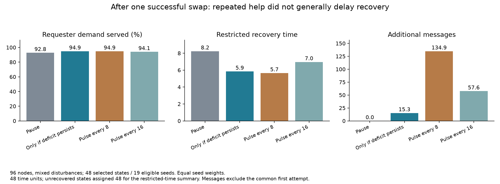
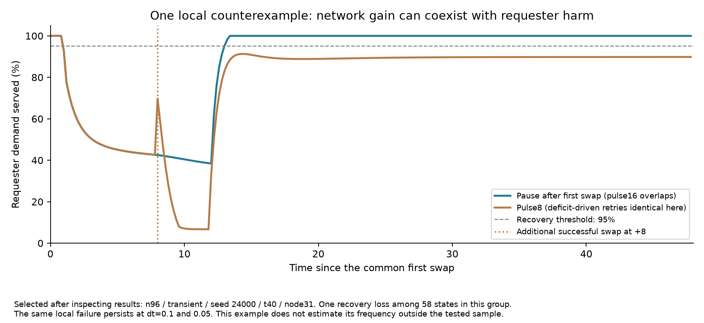

# Повторная помощь: общего удлинения хвоста нет, локальный вред возможен

8 октября 2026. **Гипотеза, что регулярные повторные вмешательства в целом затягивают восстановление, не подтвердилась.** В основной группе срок местного восстановления в среднем уменьшился. Но обнаружен воспроизводимый отдельный случай: дополнительная перестройка повысила потребление всей сети, одновременно ухудшив обслуживание инициатора и лишив его устойчивого восстановления в пределах окна. Это физическое последствие вмешательства, не шум сообщений или ошибка измерений.

[Протокол до расчёта](repeated_help_protocol_2026-10-08.md) · [Данные](../../research_results/repeated_help_2026-10-08) · [Парные сравнения](../../research_results/repeated_help_2026-10-08/paired_comparisons.csv)

## Что сравнивали

88 исходных конфигураций: 96/384 узла, смешанные нарушения или временное повреждение, 20 новых seed 24000..24019; ещё 8 конфигураций для шага 0.2/0.1 на четырёх новых seed. В шести фиксированных моментах выбирался один случайный потребитель с устойчивой нехваткой. Одна попытка помощи выполнялась на копии состояния. Технически успешная перестройка становилась общим началом четырёх независимых продолжений по 48 единиц времени: пауза; запросы при сохраняющейся нехватке с интервалом минимум 8; пульс через 8; пульс через 16.

В 528 слотах было 8 пустых групп, 302 отказа первой попытки и 218 состоявшихся перестроек. Получено 872 продолжения. Отказ не заменяли другим узлом. Никакой проверки будущей пользы для отбора не было. Поэтому «успех» здесь означает создание связи, а не доказанную помощь. Только выбранный узел инициирует повторные обращения; фоновая перестройка других участников не проверена.

Все варианты имеют одинаковую первую операцию с ценой 0.12. В таблицах расходы только дополнительных вмешательств, стоимость первой уже вычтена в общем исходном состоянии. У пульса8 ровно 5 дополнительных попыток, у пульса16 — 2. Регулятор обращается только при устойчивой нехватке. Это сравнение работающих правил, а не одинакового фактически потраченного бюджета.

## Основная группа: 96 узлов, смешанные нарушения

48 выбранных состояний, 19 из 20 seed представлены хотя бы одним успехом. Сначала усредняются состояния внутри seed, затем seed имеют равные веса. Проценты восстановления также взвешены по seed, это не сырые доли 48 состояний.

| После общей первой перестройки | Выполнение спроса инициатора | Устойчиво восстановился к концу | Ограниченный срок восстановления | Дополнительных сообщений | Дополнительная плата |
|---|---:|---:|---:|---:|---:|
| Пауза | 92.81% | 89.12% | 8.24 | 0 | 0 |
| Запрос при нехватке | 94.92% | 94.12% | 5.85 | 15.33 | 0.0165 |
| Пульс через 8 | 94.88% | 94.12% | 5.66 | 134.92 | 0.2238 |
| Пульс через 16 | 94.09% | 94.12% | 6.97 | 57.60 | 0.1440 |

Устойчивое восстановление — обслуживание >=95% на каждом оставшемся шаге до конца, причём такой участок длится минимум 4 единицы. Не восстановившимся в пределах окна присваивается 48 только для ограниченного среднего; это цензурирование, а не утверждение, что они восстановились ровно в 48. Этот показатель нельзя сравнивать только среди успешно восстановившихся, исключая остальных.

**Первичный показатель** — общее потребление ресурса сетью: пульс8 минус пауза **+0.279 единицы, 95% парный bootstrap-интервал [−0.075; +0.602]**. Средний вред не подтверждён; устойчивое преимущество по этому первичному критерию также не установлено.

Вторичный показатель ограниченного срока: −2.58 единицы [−5.09; −0.58], то есть в этой группе хвост в среднем короче. Для запросов по нехватке против паузы: общее потребление +0.180 [0.063; 0.310], срок −2.39 [−4.91; −0.46]. Это разведочные результаты без поправки на множественность.

Пульс8 против запросов по нехватке: дополнительное потребление +0.099 [−0.238; +0.403], разность срока −0.20 [−0.91; +0.32]. Его преимущество не установлено, а сообщений примерно в 8.8 раза больше. Это экономия счётчика сообщений, не измерение полной энергии. Среднее обслуживание всей сети: 87.324% / 87.358% / 87.378% / 87.325% соответственно — местное улучшение не равно большому сетевому выигрышу. Полное обслуживание всех узлов в последние 4 единицы не увеличилось.



## Индивидуальные эффекты и различие интересов узла и сети

Порог полезного/вредного изменения общего потребления задан до расчёта: >+0.01 / <−0.01 ресурса относительно паузы.

| Среда | Политика | Состояний | Польза сети | Вред сети | Удлинение ограниченного срока >=4 | Утрата восстановления в окне |
|---|---|---:|---:|---:|---:|---:|
| 96, mixed | Запрос при нехватке | 48 | 7 | 0 | 0 | 0 |
| 96, mixed | Пульс8 | 48 | 19 | 13 | 0 | 0 |
| 96, mixed | Пульс16 | 48 | 14 | 14 | 1 | 0 |
| 96, transient | Запрос при нехватке | 58 | 5 | 3 | 1 | 1 |
| 96, transient | Пульс8 | 58 | 23 | 8 | 1 | 1 |
| 384, mixed | Пульс8 | 36 | 18 | 6 | 0 | 0 |
| 384, transient | Пульс8 | 49 | 21 | 8 | 0 | 0 |

Здесь обычные количества состояний, не независимых сетей. Из 13 случаев вреда сети от пульса8 в основной группе ни один не дал удлинения срока инициатора на >=4. Не следует называть любой ресурсный проигрыш «сорванным восстановлением узла».

Есть конкретный противоположный пример: n96/transient, seed24000, начальное t40, узел31. При паузе инициатор выходит на устойчивое обслуживание через 13 единиц. При дополнительной перестройке в +8 его среднее снабжение падает с 87.23% до 77.60%, и до конца 48 единиц устойчивого восстановления нет. Последующие четыре попытки не находят перестройку. Одинаковая траектория возникает и у пульса8, и у регулятора нехватки: вред не специфичен одному пульсу.

При этом сеть потребляет **на 5.680 единицы больше**, другие потребители — на 6.347 больше. Это показывает конфликт общего результата и результата получателя помощи. Механизм выбора оценивает запас помощника и качества рёбер, но не гарантирует улучшения последующего потока именно к инициатору. Причинный контраст относится к дополнительному вмешательству целиком; отдельно стоимость и топология не разложены.



Пример выбран **после просмотра результатов**, один случай утраты восстановления из 58 состояний данной группы. Чтобы проверить, не вызван ли он грубым шагом, дополнительно проиграны тот же seed, узел и момент при dt=0.2/0.1/0.05: срок при паузе 13.00/13.10/13.15, при пульсе8 во всех случаях восстановления в окне нет; среднее снабжение около 87.2% против 77.6%. Эта дополнительная диагностика сохранена в `example_step.csv` и не подменяет первичный эксперимент. Пульс16 в этом примере сохраняет траекторию обслуживания инициатора как при паузе, но один пример не обосновывает выбор частоты16.

## Другие среды, размер и шаг

У пульса8 против паузы общий ресурс положителен в разведочных сравнениях: n96/transient +0.651 [0.313; 0.998], n384/mixed +0.634 [0.119; 1.199], n384/transient +0.595 [0.085; 1.169]. Они не подтверждают общий вред повторной помощи. На четырёх новых seed n96/mixed при обоих шагах средние направления сохраняются, интервалы общего ресурса и срока широкие и включают ноль. При dt0.2 отобрано 13 успешных состояний, при0.1 —14; это чувствительность всего отбора и динамики, не строго одинаковый набор состояний. Поздние точки t>=100 вынесены отдельно в CSV, выборкой победителя не служат.

## Что меняется в исследовании

1. Не вводим общий запрет на повторную помощь: среднее удлинение хвоста не найдено, запросы по нехватке могут помогать.
2. Регулярный пульс одного узла пока не оправдал дополнительные расходы относительно простого регулятора в основной группе.
3. Отдельно фиксируем проверенный контрпример: технически допустимая помощь может улучшить сеть и ухудшить положение инициатора. Полезность связи для адресата — самостоятельный вопрос, не решённый фактом её создания.
4. Шум сообщений, искажения наблюдения, фоновое изменение окружения другими узлами, и многократное вмешательство всей сети остаются непроверенными. Этот опыт не закрывает другие направления I–VI.

## Проверки и воспроизведение

61 автоматический тест прошёл. Проверены все 528 слотов, все 872 результата и временных ряда, все события и расходы; 24 ветки точно воспроизведены из seed, времени и первой операции. Баланс ресурса имеет максимальную ошибку 2.28×10⁻¹³. Снимки исходного кода и протокола сверены по SHA-256. Дополнительный пример содержит 12 продолжений на трёх шагах.

```sh
python -m unittest discover -s simulations -p 'test_*.py'
python simulations/experiment_repeated_help.py --workers 4
python simulations/report_repeated_help.py
python simulations/check_repeated_help_example.py
python simulations/plot_repeated_help.py
```

Для нового каталога передать `--out outputs/<имя>` каждому скрипту. Основной расчёт отказывается перезаписывать непустую папку. Первый выбор узла, окружающая динамика и перестройка воспроизводимы из seed; снимки кода сохранены. Bootstrap — 5000 повторений по seed после усреднения внутри seed. Стенду недостаёт реальной стоимости связи, искажений измерений, распределённого согласования и многообразия способов поддержки; универсальных выводов о роях или внутренних слоях LLM из него не делаем.
