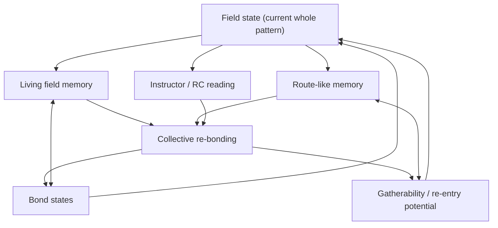

# Volume VI First Architecture Map

This note gives a first visual map of the earliest Volume VI architecture.

The first three core layers are:

1. living field memory,
2. route-like memory,
3. collective re-bonding.

## Simple dependency view



## Reading the map

- `Field state` is the visible whole pattern of the system.
- `Living field memory` stores what kinds of configurations remain meaningful and gatherable.
- `Route-like memory` stores not only where the field is, but how it arrived there.
- `Instructor / RC reading` interprets the present field, but does not replace it.
- `Collective re-bonding` uses field memory, route memory, and current reading to reshape weak ties.
- `Bond states` feed back into the field itself.
- `Gatherability / re-entry potential` expresses whether the field can realistically become coherent again.

## Arrow meanings

- `A --> B`
  - A mainly influences B.

- `A <--> B`
  - A and B influence each other.

## First causal story

1. The field enters a difficult regime.
2. The current field pattern is read at three levels:
   - as present state,
   - as remembered field tendency,
   - as remembered route of entry.
3. The instructor reads but does not fully command the situation.
4. The network begins collective re-bonding.
5. Bond states change.
6. The field pattern changes.
7. Gatherability either improves or degrades.

## Minimal interpretation

The next architecture is not:

- instructor alone,
- memory alone,
- or bonds alone.

It is a loop:

- field,
- memory,
- route,
- re-bonding,
- renewed field.
```
